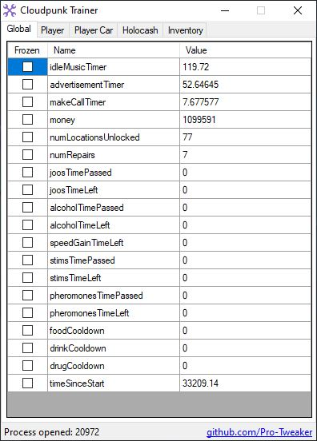
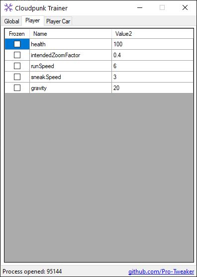
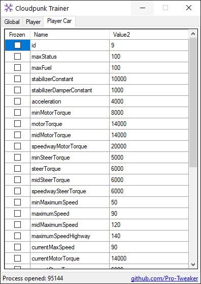

# Cloudpunk Trainer
Explore Nivalis in total freedom !
## Compatible Versions
- Steam 'Butter Update' (01.07.2020 ) [3D32D76C7F402C4BC0B6127B108D5557]
- Latest Steam (14.07.2020 ) [3D32D76C7F402C4BC0B6127B108D5557]
## Backup Save
```
C:\Users\<username>\AppData\LocalLow\ION LANDS\Cloudpunk
```
## How to use
1. Start game
2. Start tool
3. Edit values
4. Enjoy
### Notes
After activation, the tool will display only 0 as values.  
For Global and Player values, you need to go back in the game and be on foot.  
For Player Car values, you need to be inside you HOVA.  
Wait until tool display values, then edit.
## Screenshots



