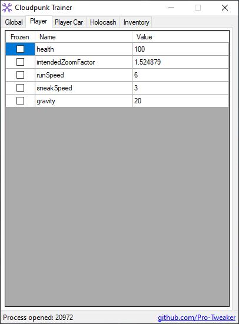
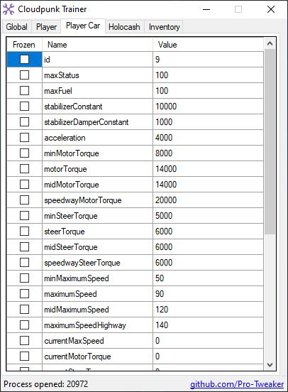

# Cloudpunk Trainer
Explore Nivalis in total freedom !
## Compatible Versions
- [Steam Steam Update (30.10.2020)](https://steamdb.info/patchnotes/5760339/)
## Changelog
### 0.1.2.0
```
Updated Global offsets
```
Compatible with:
- [Steam Steam Update (30.10.2020)](https://steamdb.info/patchnotes/5760339/)
### 0.1.1.0
```
Updated Global signature and offsets
Updated Player Car signature and offsets
```
Compatible with:
- [Steam 'Cockpit Update' (27.10.2020)](https://steamdb.info/patchnotes/5744405/)
### 0.1.0.0
```
Initial Release
```
Compatible with:
- [Steam 'Butter Update' (01.07.2020 )](https://steamdb.info/patchnotes/5238168/)
- [Steam Update (14.07.2020)](https://steamdb.info/patchnotes/5288075/)
## Backup Save
It is advisable to make a copy of your backup before using this tool.  
You can find your backup here:
```
C:\Users\<username>\AppData\LocalLow\ION LANDS\Cloudpunk
```
## How to use
1. Start game
2. Start tool
3. Edit values
4. Enjoy
### Notes
After activation, the tool will display only 0 as values.  
For Global and Player values, you need to go back in the game and be on foot.  
For Player Car values, you need to be inside you HOVA.  
Wait until tool display values, then edit.
## Screenshots



